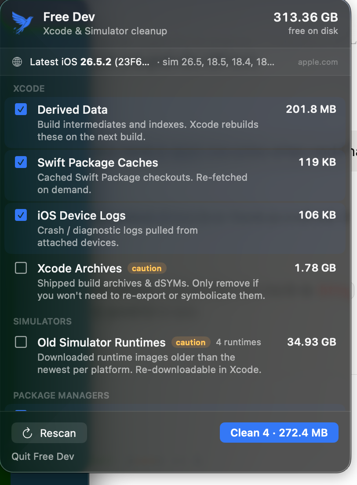

# 🕊️ Free Dev

**Your Mac dev tools are hoarding gigabytes. Free Dev sets them loose.**

A tiny, safety-first macOS **menu bar app** that reclaims disk space eaten by
Xcode, the iOS Simulator, and every package manager you've ever `install`ed —
built for Apple, Flutter, and cross-platform developers.



## Why this exists

I'm a **Flutter developer**, which means I ship the same app to **iOS *and*
Android** — and my Mac quietly foots the bill. Flutter builds go *through Xcode*
for iOS, through **Gradle** for Android, drag in **CocoaPods** and **Dart
packages** along the way, and boot **simulators** on both sides. Every one of
those leaves cache behind.

One day I looked at my **1 TB drive** and a huge chunk of it was just… *gone*.
Not videos, not downloads — Derived Data, old iOS DeviceSupport symbols,
simulator runtimes I hadn't booted in months, Gradle caches, and a
`~/.pub-cache` the size of a small country. Death by a thousand caches.

So I did it the hard way: `du -sh` here, `rm -rf` there, squinting at paths like
`~/Library/Developer/Xcode/iOS DeviceSupport/iPhone16,2 26.2.1 (23C71)` and
praying I wasn't about to delete something I'd regret. Tedious, nerve-wracking,
and I *still* wasn't sure I'd gotten it all.

I'd wanted a proper little app to do this safely for ages — but "build a
polished, tested macOS menu bar utility" is exactly the side quest that never
makes it off the someday list. So I built it **with Claude** instead, and it
took an afternoon rather than a string of lost weekends — it wrote the Swift,
the tests, and the whole Xcode project while I steered the scope and the one
rule that mattered most — *never delete anything I'd miss*. That partnership is
the only reason this exists at all. 🕊️

## What it does

- Shows your **free disk space** and the **latest public iOS version** (checked
  online), next to the simulator runtimes you have installed.
- Scans well-known cache locations across **Xcode**, **Simulators**, and
  **Package Managers**, grouped into tidy sections, measuring each with `du`
  concurrently so it's quick.
- **Auto-hides** whatever you don't have. No Homebrew? No Homebrew row.
- Tick what to clean, hit the button, done — behind a confirmation dialog, with
  risky stuff always **unchecked by default**.

## The safety pact 🔒

Free Dev is **deliberately paranoid**. It only ever touches regenerable caches
and *orphaned / redundant* leftovers. It will never delete your source code, and
anything with real value (shipped archives, older-OS symbols, older simulator
runtimes) is flagged ⚠️ and **never ticked for you**.

### Xcode
| Item | Location | Default |
|------|----------|:-------:|
| Derived Data | `~/Library/Developer/Xcode/DerivedData` | ✅ |
| Xcode Caches | `~/Library/Caches/com.apple.dt.Xcode` | ✅ |
| Swift Package Caches | `~/Library/Caches/org.swift.swiftpm` | ✅ |
| iOS Device Logs | `~/Library/Developer/Xcode/iOS Device Logs` | ✅ |
| Old Device Symbols | `~/Library/Developer/Xcode/{iOS,watchOS,tvOS,xrOS} DeviceSupport` | ⚠️ |
| Xcode Archives | `~/Library/Developer/Xcode/Archives` | ⚠️ |

### Simulators
| Item | Mechanism | Default |
|------|-----------|:-------:|
| Simulator Caches | `~/Library/Developer/CoreSimulator/Caches` | ✅ |
| Orphaned Simulators | `xcrun simctl delete unavailable` | ✅ |
| Old Simulator Runtimes | `xcrun simctl runtime delete` (keeps newest per platform) | ⚠️ |

### Package Managers (auto-hidden when absent)
| Item | Location | Default |
|------|----------|:-------:|
| Homebrew | `~/Library/Caches/Homebrew` | ✅ |
| CocoaPods | `~/Library/Caches/CocoaPods` | ✅ |
| Carthage | `~/Library/Caches/org.carthage.CarthageKit` | ✅ |
| npm | `~/.npm/_cacache` | ✅ |
| Yarn | `~/Library/Caches/Yarn` | ✅ |
| pnpm | `~/Library/Caches/pnpm` | ✅ |
| Dart / Flutter | `~/.pub-cache/hosted` | ✅ |

The fine print that keeps you safe:

- Deletions go through `FileManager`, and a hard-coded allow-list
  (`Cleaner.isSafePath`) refuses anything outside `~/Library/Developer`,
  `~/Library/Caches`, `~/.npm`, and `~/.pub-cache`.
- Cache directories are **emptied**, not deleted — the folder itself stays.
- **Old Device Symbols** keeps *every* folder at the newest OS version (so
  hopping between devices on the current OS never loses symbols) and removes
  only strictly-older versions.
- The Dart/Flutter item cleans `~/.pub-cache/hosted` only, leaving your
  globally-activated tools in `~/.pub-cache/bin` untouched.

## Where "latest iOS" comes from

Straight from Apple's own public metadata feed `https://gdmf.apple.com/v2/pmv`
(the one MDM uses). If that's unreachable it falls back to the community
[`ipsw.me`](https://ipsw.me) API, and finally to your newest installed simulator
runtime.

## Install

On any Mac with Xcode (it builds & signs locally, so Gatekeeper stays quiet):

```
./install.sh            # build Release → /Applications → launch
./install.sh --login    # …and start automatically at login
```

Or just open `FreeDev.xcodeproj` and press ⌘R.

Requirements: macOS 14+, Xcode with the iOS platform installed. It's a
non-sandboxed local dev tool (it reads `~/Library/Developer` and runs
`xcrun simctl`).

## Tests

```
xcodebuild test -project FreeDev.xcodeproj -scheme FreeDev -destination 'platform=macOS'
```

The tests cover the safety-critical bits: the path allow-list, numeric version
comparison, device-support version parsing (including the device-prefixed
`iPhone16,2 26.2.1 (23C71)` form), and the cleaners themselves.

## Project layout

```
FreeDev/
  FreeDevApp.swift          # @main — MenuBarExtra scene
  Support/                  # Shell, byte/version formatting, disk-space helpers
  Model/CleanupItem.swift   # one cleanable category + its action
  Services/                 # DiskScanner, Cleaner, SimulatorService, VersionService, DeviceSupport
  Store/AppModel.swift      # @Observable state + scan/clean orchestration
  Views/                    # MenuContentView, ItemRow
FreeDevTests/               # XCTest suites
```

## License

[MIT](LICENSE) © 2026 Troy Miles
